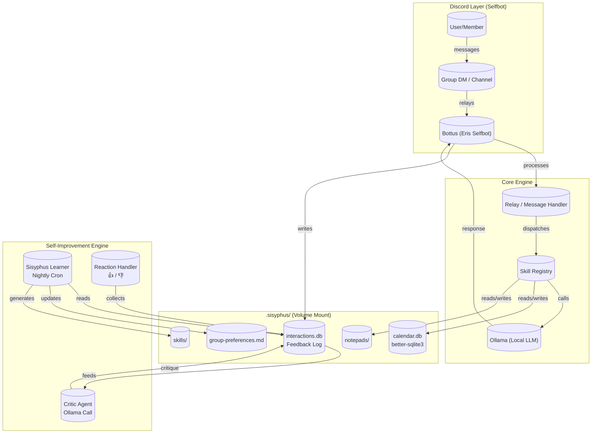

# Bottus v2 Development Plan

**Project**: Bottus v2 - Self-Improving Discord Group Assistant  
**Type**: Major Feature Development  
**Priority**: High  
**Estimated Timeline**: 5 Phases over 4-6 weeks  

---

## Executive Summary

Bottus v2 transforms the existing Discord relay bot into a fully local, self-improving group assistant. The upgrade adds three killer features: a local SQLite calendar with recurring events via rrule, a closed feedback loop where every response is critiqued by a secondary Ollama call, and a Sisyphus-inspired self-improvement engine that nightly reads interactions to update prompts and propose new skills. Everything stays offline—zero external APIs, zero cloud sync, all data persisted in the `.sisyphus/` volume mount.

**Three Core Goals for v2:**

1. **Local Calendar Mastery** — Replace Google Calendar dependencies with better-sqlite3, add recurring events, ICS export, and intelligent reminders.
2. **Self-Improving Intelligence** — Every bot response gets critiqued; feedback via 👍/👎 reactions auto-collects; nightly Sisyphus Learner proposes prompt improvements.
3. **Living Knowledge Base** — All learned preferences, group rules, and skill proposals stored as markdown notepads that the bot can read and update.

---

## Architecture Diagram



---

## Phase 0 – Immediate Cleanup

### 0.1 Remove Google Calendar Code

**Objective**: Delete all Google-specific code from existing calendar implementation.

**Tasks**:

- [ ] Remove `googleapis` dependency from `package.json`
- [ ] Delete Google OAuth flow code in `src/services/calendar.ts`
- [ ] Keep: date parsing, event schema, display logic
- [ ] Verify no Google API keys in `.env`

**File Changes**:

```diff
# package.json - REMOVE
- "googleapis": "^140.0.0"
# package.json - ADD
+ "better-sqlite3": "^11.0.0"
```

### 0.2 Update Dockerfile.relay

**Objective**: Switch from sql.js to better-sqlite3 (native bindings require build tools).

**Tasks**:

- [ ] Add build tools to Dockerfile (`apk add python3 make g++`)
- [ ] Update npm install to `--omit=dev` for production
- [ ] Ensure `.sisyphus/` volume mount is preserved

**Updated Dockerfile.relay**:

```dockerfile
FROM node:22-alpine

# Install native bindings build tools
RUN apk add --no-cache python3 make g++

WORKDIR /app

COPY package*.json ./
RUN npm install --omit=dev

COPY tsconfig*.json ./
COPY src ./src
COPY .sisyphus /.sisyphus

ENV NODE_ENV=production
ENV TZ=Europe/Oslo

CMD ["node", "dist/relay/index.js"]
```

### 0.3 Environment Variables

**Objective**: Add v2-specific environment configuration.

**Add to `.env`** (never commit):

```bash
# Calendar & Time
TIMEZONE=Europe/Oslo
BOT_LANGUAGE=nb,en

# Self-improvement settings
CRITIC_ENABLED=true
CRITIC_MODEL=${OLLAMA_MODEL}
FEEDBACK_WINDOW=100
NIGHTLY_LEARN=true

# Storage paths
SISYPHUS_PATH=/app/.sisyphus
CALENDAR_DB=/app/.sisyphus/calendar.db
INTERACTIONS_DB=/app/.sisyphus/interactions.db
```

---

## Phase 1 – Local Calendar Core

### 1.1 Database Schema

**File**: `src/db/calendar-schema.ts`

**Purpose**: SQLite schema for calendar events with recurrence and reminders support.

**Key Interfaces**:

```typescript
import Database from 'better-sqlite3';

export interface CalendarEvent {
  id: string;
  title: string;
  description?: string;
  startTime: number;        // Unix timestamp (ms)
  endTime?: number;         // Unix timestamp (ms)
  timezone: string;
  recurrence?: string;      // RRule string
  recurrenceEnd?: number;   // Unix timestamp
  location?: string;
  creatorId: string;
  channelId: string;
  guildId?: string;
  rsvp: Record<string, 'yes' | 'no' | 'maybe'>;
  reminders: number[];      // Minutes before event
  createdAt: number;
  updatedAt: number;
}

export interface Reminder {
  id: string;
  eventId: string;
  userId: string;
  remindAt: number;         // Unix timestamp
  sent: boolean;
  createdAt: number;
}

export function initCalendarDb(db: Database.Database): void {
  db.exec(`
    CREATE TABLE IF NOT EXISTS calendar_events (
      id TEXT PRIMARY KEY,
      title TEXT NOT NULL,
      description TEXT,
      startTime INTEGER NOT NULL,
      endTime INTEGER,
      timezone TEXT DEFAULT 'Europe/Oslo',
      recurrence TEXT,
      recurrenceEnd INTEGER,
      location TEXT,
      creatorId TEXT NOT NULL,
      channelId TEXT NOT NULL,
      guildId TEXT,
      rsvp TEXT DEFAULT '{}',
      reminders TEXT DEFAULT '[]',
      createdAt INTEGER NOT NULL,
      updatedAt INTEGER NOT NULL
    );

    CREATE INDEX IF NOT EXISTS idx_events_start ON calendar_events(startTime);
    CREATE INDEX IF NOT EXISTS idx_events_channel ON calendar_events(channelId);
    CREATE INDEX IF NOT EXISTS idx_events_recurrence ON calendar_events(recurrence);

    CREATE TABLE IF NOT EXISTS reminders (
      id TEXT PRIMARY KEY,
      eventId TEXT NOT NULL,
      userId TEXT NOT NULL,
      remindAt INTEGER NOT NULL,
      sent INTEGER DEFAULT 0,
      createdAt INTEGER NOT NULL,
      FOREIGN KEY (eventId) REFERENCES calendar_events(id)
    );

    CREATE INDEX IF NOT EXISTS idx_reminders_time ON reminders(remindAt);
  `);
}
```

### 1.2 Calendar Service

**File**: `src/services/calendar-v2.ts`

**Purpose**: Full calendar CRUD with rrule recurrence, chrono-node parsing, ICS export.

**Key Methods**:

- `createEvent()` — Create event with optional recurrence
- `getEvents()` — Retrieve events by channel with today/week/all range
- `parseNaturalDate()` — Use chrono-node with Norwegian date patterns
- `generateICS()` — Export events to iCalendar format

**Dependencies**: `better-sqlite3`, `rrule`, `chrono-node`, `uuid`

### 1.3 Calendar Skill

**File**: `src/relay/skills/calendar-skill-v2.ts`

**Purpose**: Natural language calendar interactions via the skill system.

**Key Commands Handled**:

- Create event: "remind me to X on Monday at 10"
- List events: "what's on today", "kalender denne uken"
- Export: "export calendar", "last ned ICS"
- Delete: "delete event X"

**Norwegian Support**: `møte`, `avtale`, `planlegg`, `på mandag`, `kl 10`

### 1.4 Scheduler Integration

**File**: `src/services/scheduler.ts`

**Purpose**: Use `node-schedule` for reminder triggers.

**Tasks**:

- [ ] Integrate `node-schedule` for cron-style scheduling
- [ ] Queue reminder jobs when events created
- [ ] Cancel jobs when events deleted
- [ ] Handle timezone-aware scheduling (Europe/Oslo)

---

## Phase 2 – Feedback & Critic System

### 2.1 Interactions Database Schema

**File**: `src/db/interactions-schema.ts`

**Purpose**: Store all bot interactions and their critiques.

```typescript
export interface Interaction {
  id: string;
  messageId: string;
  channelId: string;
  userId: string;
  userMessage: string;
  botResponse: string;
  skillsUsed: string[];
  timestamp: number;
  feedback?: 'positive' | 'negative' | null;
  feedbackComment?: string;
}

export interface Critique {
  id: string;
  interactionId: string;
  critique: string;
  score: number;          // 1-10
  suggestions: string;
  timestamp: number;
}
```

### 2.2 Critic Prompt

**File**: `src/prompts/critic.md`

**Purpose**: Template for secondary Ollama call to critique bot responses.

**Evaluation Criteria**:

- Appropriateness (1-10)
- Tone (1-10) — matches group style?
- Conciseness (1-10)
- Accuracy (1-10)
- Helpfulness (1-10)

**Output Format**: JSON with score, strengths, weaknesses, suggestions.

### 2.3 Feedback Handler

**File**: `src/relay/handlers/feedback.ts`

**Purpose**: Handle 👍/👎 reactions and explicit feedback commands.

**Tasks**:

- [ ] React handler for emoji reactions on bot messages
- [ ] `!feedback <message-id> <comment>` command parser
- [ ] Async non-blocking critique calls after bot responses
- [ ] Store feedback in interactions.db

---

## Phase 3 – Sisyphus Self-Improvement Engine

### 3.1 Learner Script

**File**: `src/scripts/sisyphus-learner.ts`

**Purpose**: Nightly analysis of recent interactions to propose improvements.

**Workflow**:

1. Fetch last N interactions (configurable, default 50)
2. Fetch associated critiques
3. Run Ollama analysis to identify patterns
4. Generate insights: tone, preferences, skills, prompts
5. Update `group-preferences.md`
6. Log skill proposals for admin review

**Key Methods**:

- `run()` — Main entry point
- `analyzePatterns()` — Ollama-powered pattern detection
- `generateImprovements()` — Write to notepads

### 3.2 Nightly Cron

**File**: `src/scripts/nightly-cron.ts`

**Purpose**: Schedule Sisyphus learning cycles.

**Configuration**:

- Default: 3:00 AM Europe/Oslo
- Configurable via environment
- Uses `node-schedule` with timezone support

### 3.3 /teach Command

**File**: `src/relay/handlers/teach.ts`

**Purpose**: Allow admins to teach the bot facts, preferences, rules, or propose skills.

**Syntax**:

- `!teach fact <information>` — Add fact to knowledge base
- `!teach preference <what group prefers>` — Update tone settings
- `!teach rule <group rule>` — Add to behavioral guidelines
- `!teach skill <skill description>` — Log for admin approval

**Admin-Only**: Only configured admin user IDs can use this command.

---

## Phase 4 – Polish & UX

### 4.1 Commands List

**File**: `src/commands/v2-commands.ts`

| Command | Description |
|---------|-------------|
| `!kalender` | Show this week's events |
| `!kalender today` | Show today's events |
| `!event <title> <date>` | Create calendar event |
| `!event <title> weekly <days>` | Create recurring event |
| `!export` | Export calendar as ICS |
| `!delete event <title>` | Delete event |
| `!feedback <id> <comment>` | Give feedback |
| `!improve` | Run Sisyphus cycle (admin) |
| `!teach <type> <content>` | Teach bot (admin) |
| `!preferences` | Show group preferences |
| `!stats` | Usage statistics |
| `!help` | All commands |

### 4.2 Timezone Handler

**File**: `src/utils/timezone.ts`

**Purpose**: Norwegian-first date parsing and formatting.

**Features**:

- Default timezone: Europe/Oslo
- chrono-node with `timezone: 'Europe/Oslo'`
- Norwegian format: "mandag 3. mars kl 10:00"

### 4.3 Norwegian Language Support

**File**: `src/utils/i18n.ts`

**Purpose**: Bilingual (Norwegian/English) string management.

**Supported Locales**: `nb` (default), `en`

**Key Strings**: Calendar messages, feedback confirmations, error messages, teach responses.

### 4.4 Structured Logging

**File**: `src/utils/logger.ts`

**Purpose**: JSON-structured logging with rotation.

**Features**:

- Log levels: debug, info, warn, error
- In-memory buffer (1000 entries)
- Context attachment support

---

## Phase 5 – Safety & Reliability

### 5.1 Rate Limiting

**File**: `src/relay/utils/rate-limit-v2.ts`

**Purpose**: Protect Discord API from rate limit violations.

**Configuration**:

- Window: 60 seconds
- Max requests: 15 (Discord allows 50, we use conservative 15)

### 5.2 Error Recovery

**File**: `src/utils/error-recovery.ts`

**Purpose**: Retry logic and circuit breaker pattern.

**Features**:

- Exponential backoff retry
- Circuit breaker for external services
- Ollama-specific error handling

### 5.3 Backup System

**File**: `src/scripts/backup.ts`

**Purpose**: Protect `.sisyphus/` data with automated backups.

**Features**:

- Daily tarball backups
- Keep last 7 backups
- Backup: calendar.db, interactions.db, notepads/

### 5.4 Admin Protections

**Purpose**: Prevent abuse of powerful commands.

**Restrictions**:

- `!improve` — Admin only
- `!teach` — Admin only
- Rate limit improve/teach commands

---

## File-by-File Implementation Plan

| File | Purpose | Type |
|------|---------|------|
| `src/db/calendar-schema.ts` | Calendar DB schema | NEW |
| `src/services/calendar-v2.ts` | Calendar CRUD service | NEW |
| `src/relay/skills/calendar-skill-v2.ts` | Calendar skill | NEW |
| `src/services/scheduler.ts` | Reminder scheduler | NEW |
| `src/db/interactions-schema.ts` | Interactions DB schema | NEW |
| `src/relay/handlers/feedback.ts` | Feedback handler | NEW |
| `src/prompts/critic.md` | Critic prompt template | NEW |
| `src/scripts/sisyphus-learner.ts` | Learning script | NEW |
| `src/scripts/nightly-cron.ts` | Cron scheduler | NEW |
| `src/relay/handlers/teach.ts` | Teach command | NEW |
| `src/utils/timezone.ts` | Timezone utilities | NEW |
| `src/utils/i18n.ts` | Internationalization | NEW |
| `src/utils/logger.ts` | Structured logging | NEW |
| `src/relay/utils/rate-limit-v2.ts` | Rate limiter | NEW |
| `src/utils/error-recovery.ts` | Retry/circuit breaker | NEW |
| `src/scripts/backup.ts` | Backup script | NEW |
| `src/commands/v2-commands.ts` | Command registry | NEW |
| `package.json` | Add dependencies | UPDATE |
| `Dockerfile.relay` | Native bindings | UPDATE |
| `.env` | V2 config | UPDATE |

**New Dependencies**:

```json
{
  "better-sqlite3": "^11.0.0",
  "rrule": "^2.7.0",
  "node-schedule": "^2.1.0",
  "uuid": "^9.0.0",
  "zod": "^3.22.0"
}
```

---

## Testing Roadmap

### Unit Tests (Vitest)

| Test File | Coverage |
|-----------|----------|
| `tests/calendar-schema.test.ts` | DB initialization |
| `tests/calendar-v2.test.ts` | Event CRUD, recurrence, ICS |
| `tests/feedback.test.ts` | Feedback logging |
| `tests/sisyphus-learner.test.ts` | Pattern analysis |
| `tests/timezone.test.ts` | Norwegian parsing |

### Integration Tests

**File**: `tests/integration/calendar-flow.test.ts`

- Create event via natural language
- List events (today/week)
- Export ICS and validate format
- Delete event
- Verify reminders scheduled

### End-to-End Test Plan

1. Create test Discord server
2. Bot joins as selfbot
3. Execute full conversation flows
4. Verify feedback collection
5. Run `!improve` and verify notepad updates

---

## Future-Proof Extensions

### Voice Channel Activity
- Detect voice channel joins
- Offer transcription via local Whisper.cpp

### Image Analysis
- ComfyUI already integrated (keep)
- Add: local Tesseract OCR
- Add: Ollama vision for captioning

### Local Web Search
- Self-hosted SearXNG
- Zero external API dependencies

### Multi-Group Support
- Separate `.sisyphus/` per group
- Shared Ollama, isolated preferences

---

## Success Criteria

### Phase 0 Completion
- [ ] No Google dependencies remain
- [ ] better-sqlite3 installs in Docker
- [ ] Environment variables documented

### Phase 1 Completion
- [ ] Calendar events create/retrieve/delete
- [ ] Recurring events work (weekly/monthly)
- [ ] ICS export valid
- [ ] Reminders fire at correct times

### Phase 2 Completion
- [ ] All bot responses logged
- [ ] Critic runs on each response
- [ ] 👍/👎 reactions collect feedback

### Phase 3 Completion
- [ ] Nightly cron runs successfully
- [ ] Preferences file updates
- [ ] Skill proposals log correctly

### Phase 4 Completion
- [ ] All commands documented
- [ ] Norwegian date parsing accurate
- [ ] Bilingual strings work

### Phase 5 Completion
- [ ] Rate limiting prevents 429 errors
- [ ] Circuit breaker protects Ollama
- [ ] Backups rotate correctly
- [ ] Admin-only commands protected

---

## Risks and Mitigations

| Risk | Impact | Mitigation |
|------|--------|------------|
| better-sqlite3 build fails in Docker | High | Multi-stage build with build tools |
| Ollama critique slows responses | Medium | Async non-blocking calls |
| Large interaction history | Medium | Configurable window size |
| Selfbot ToS violations | High | Rate limiting, minimal history |

---

## Dependencies on Existing Code

- **Skill System**: Extends existing `src/relay/skills/interfaces.ts`
- **Relay**: Integrates with `src/relay/index.ts` message handler
- **Ollama Client**: Reuses `src/relay/ollama.ts`
- **Commands**: Follows `src/commands/index.ts` pattern
